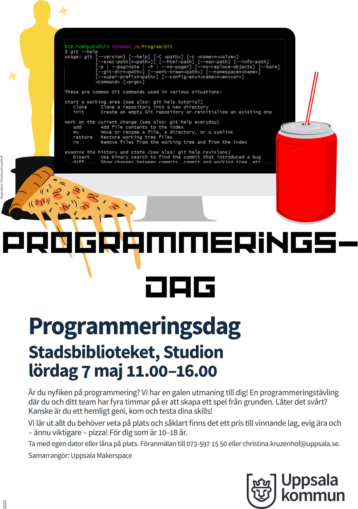

# Programmeringsdag

Är du nyfiken på programmering? Vi har en galen utmaning till dig! En programmeringstävling
där du och ditt team har fyra timmar på er att skapa ett spel från grunden. Låter det svårt?
Kanske är du ett hemligt geni, kom och testa dina skills!
Vi lär ut allt du behöver veta på plats och såklart finns det ett pris till vinnande lag, evig ära och
– ännu viktigare – pizza! För dig som är 10–18 år.
Ta med egen dator eller låna på plats. Föranmälan till 073-597 15 50 eller christina.kruzenhof@uppsala.se.

 * Vad: programmeringstävling
   skapa ett datorspel i ett lag
 * Vem: ungdomar 10-18 år
 * När: lördag maj 7 11:00-16:00
 * Var: Stadsbibliotek Uppsala, 
   Svartbäcksgatan 17, 753 75 Uppsala
 * Kostnad: gratis

## Text for contestants

 * Your purpose is to learn how to do awesome things quickly
 * Bring your own laptop if possible. Else let us know: we have 9 (7 at SB, 2 at UMS)
 * The team is around 4 persons
 * You will be mixed with other contestants, to assure all teams contain
   experienced and inexperienced programmers
 * No coding skills needed: just learn fast :-)

## Text for coaches

 * Your purpose is to help the team work together
 * You are not allowed to touch a keyboard
 * Contestants are the boss
 * A team is around 4 persons

## Schedule

When       |What                                   |Where?
-----------|---------------------------------------|---------------
11:00-11:15|Door open                              |Studium + rooms
11:15-11:20|Plenary talk: what are we going to do? |Studium + rooms
11:20-13:00|Work                                   |Studium + rooms
13:00-13:30|Pizza                                  |Studium + rooms
13:30-15:00|Work                                   |Studium + rooms
15:00-15:30|Presentations                          |Studium + rooms
15:30-15:35|Winner and closing                     |Studium + rooms
15:45-16:00|Time to go                             |Studium + rooms

## Extended schedule

That is, for volunteers

When       |Competitors         |UBS                    |UMS
-----------|--------------------|-----------------------|-----------------------
10:00-10:15|.                   |Prepare for contestants|Prepare for contestants
10:15-10:30|.                   |Prepare for contestants|Prepare for contestants
10:30-10:45|.                   |Prepare for contestants|Prepare for contestants
10:45-11:00|.                   |Prepare for contestants|Prepare for contestants
11:00-11:10|Come in and wait    |Host                   |Host
11:10-11:20|Listen              |.                      |Talk
11:20-11:30|Form teams          |.                      |Coach
11:30-11:45|Program             |Inventorize pizza      |Coach
11:45-12:00|Program             |Inventorize pizza      |Coach
12:00-12:15|Program             |Order pizza            |Coach
12:15-12:30|Program             |.                      |Coach
12:30-12:45|Program             |.                      |Coach
12:45-13:00|Program             |Prepare for pizza      |Coach
13:00-13:00|Eat pizza           |.                      |.
13:15-13:30|Eat pizza           |.                      |.
13:30-13:45|Program             |Clean up from pizza    |Coach
13:45-14:00|Program             |.                      |Coach
14:00-14:15|Program             |.                      |Coach
14:15-14:30|Program             |.                      |Coach
14:30-14:45|Program             |.                      |Coach
14:45-15:00|Try-out presentation|.                      |Technical assist
14:45-15:00|Program             |.                      |Coach
15:00-15:15|Try-out presentation|.                      |Technical assist
15:00-15:15|Program             |.                      |Coach
15:15-15:30|Try-out presentation|.                      |Technical assist
15:15-15:30|Program             |.                      |Coach
15:30-15:45|Try-out presentation|.                      |Technical assist
15:30-15:45|Present             |.                      |Listen
15:45-16:00|Present             |.                      |Listen
16:00-16:15|Leave               |Host                   |Host
16:15-17:00|.                   |Clean up               |Clean up
17:00-17:30|.                   |Evaluate               |Evaluate

## Done

Responsible|What
-----------|-----------------------------------------------
R          | Get volunteers to assist the competitors
R          | Ask UMS for volunteers/coaches 
USB        | Projection screen at Studium works
USB        | Do publicity to get competitors
USB        | 1 host for questions as drinks, food, etc
USB        | Water, cups, 1 bottle of saft and cola and fanta and 7-up
USB        | Order the pizza, take the delivery to 

## Abbreviations

 * R: Richel
 * USB: Uppsala Stadsbibliotek
 * UMS: Uppsala Makerspace
 * WIP: Work In Progress

## Evaluation

There were 19 participants, 7 of which from UMS.

What we observed:

 * The day went smoothly, with enough volunteers being present
   and good enough presentation
 * At that day, the UMS participants were not experienced enough
   to really work together: code was copied using Discord or
   USB stick. Next time, the UMS participants will be better versed.
 * As the UMS participants were not well versed in working together yet,
   not all team members could contribute. On the other hand, all
   participants could do things fitting a Programming Day.
 * At the start of the day, the parents were told that there would
   be a presentation at 15:30. Although this idea popped up late,
   many parents should up anyways
 * It could be argued that 150 kroners per participant (i.e. the pizza and
   drinks) is quite expensive. 
 * Unexpectedly, participants could take a free book from the library.
   This opportunity was used by some participants, especially the older ones
 * There was a group of two 10-year-old and three 15-year-old. 
   This age difference gap was no problems, as both age groups respected one
   another
 * Some kids found it cool to drink the most fizzy drinks

What could be improved:

 * We should use a bigger room, so all participants can join:
   we had to say 'no' to some, as it was full
 * Have better flyers for the UMS courses
 * Let the parents know beforehand there is a presentation
 * Have a mechanism against the fizzy drinks competition

## Links

 * [Event at USB](https://bibliotekuppsala.se/web/arena/events#/events/f596144f-315f-4813-8e7d-adcd7e7bdbd8)
