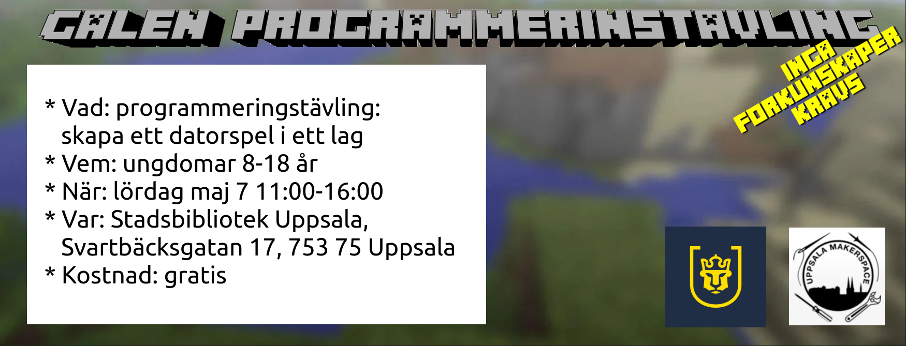

# Galen programmeringstävling

:construction: This page is in English for now

:construction: These are all suggestions for now

Hackathon at the Stadsbibliothek Uppsala.

 * Vad: programmeringstävling
   skapa en datorspel i ett lag
 * Vem: ungdomer 8-18 år
 * När: lördag Maj 7 11:00-16:00
 * Var: Stadsbibliothek Uppsala, 
   Svartbäcksgatan 17, 753 75 Uppsala
 * Kostad: gratis

 * What: Programming competition: make a game in a team
 * When: Saturday May 7th 2022 11:00-16:00
 * Where: Stadsbibliothek Uppsala, Svartbäcksgatan 17, 753 75 Uppsala
 * Costs: ?10 euro, ?free [DISCUSS]
 * Goal: doing something cool for young adolescents at the Stadsbibliothek
 * Max competitors: 20 ?more is always possible [DISCUSS]
 * Competitors pers team: 4
 * Price: ?5 euro times the number of competitors, ?library price, ?Makerspace price [DISCUSS]

## Publicity text

:construction: to be translated

Galen programmeringstävling

Ingen kunskap krävs!

Programmering kan inte vara så svårt!
För att prova det, finns här en programmeringstävling, ingen kunskap krävs!
Lyckligtvis är du hemligt en geni, så att lära nya saker är ingen problem alls.
Du och din team ska ha fyra timmar för att skapa en game från ingenting.
Dett finns en pris, evig ära och -endå vigtigare- pizza!

## Text for contestants

 * Your purpose is to learn how to do awesome things quickly
 * Bring your own laptop if possible. Else let us know: we have 9 (7 at SB, 2 at UMS)
 * The team is around 4 persons
 * You will be mixed with other contestants, to assure all teams contain
   experienced and inexperienced programmers
 * No coding skills needed: just learn fast :-)

## Text for coaches

 * Your purpose is to help the team work together
 * You are not allowed to touch a keyboard
 * Contestants are the boss
 * A team is around 4 persons

## Schedule

When       |What                                   |Where?
-----------|---------------------------------------|---------------
11:00-11:15|Door open                              |Studium + rooms
11:15-11:20|Plenary talk: what are we going to do? |Studium + rooms
11:20-13:00|Work                                   |Studium + rooms
13:00-13:30|Pizza                                  |Studium + rooms
13:30-15:00|Work                                   |Studium + rooms
15:00-15:30|Presentations                          |Fancy room
15:30-15:35|Winner and closing                     |Fancy room
15:45-16:00|Time to go                             |Studium + rooms

## Extended schedule

That is, for volunteers

When       |What                                   |Where?
-----------|---------------------------------------|----------------------------
10:00-11:00|Prepare for contestants                |Studium + rooms
12:45-13:00|Prepare for pizza                      |Studium + rooms
13:15-13:45|Clean up from pizza                    |Studium + rooms
13:45-14:15|Prepare for presentation               |Fancy room
16:00-17:00|Clean up                               |Studium + rooms + fancy room
17:00-17:30|Evaluate                               |Any pub, e.g. Churchill Arms

## Needed

Responsible|What
-----------|-----------------------------------------------
SB         | Projection screen at Studium works
SB         | Projection screen and mic works at Fancy Room
R          | [wait until first reply from SB] Do publicity to get competitors
SB         | Do publicity to get competitors
R          | [WIP] Get volunteers to assist the competitors
SB         | 1 host for questions as drinks, food, etc
SB         | Water, cups, 1 bottle of saft and cola and fanta and 7-up
?SB        | Club Mate, which is a typical hackathon drink
SB         | Order the pizza, take the delivery to 
R          | [sent email] Ask MachineGaming for volunteers/coaches 
R          | [wait until first reply from SB] Ask UMS for volunteers/coaches 

## Abbreviations

 * R: Richel
 * SB: Stadsbibliotek
 * UMS: Uppsala Makerspace
 * WIP: Work In Progress

## Links

 * Where I created the logo: [https://fontmeme.com/minecraft-font/](https://fontmeme.com/minecraft-font/)
